# ルービックキューブを速く揃える

[トップ](index.html) · [クロス](cross.html) · [F2L入門](f2l.html) · [OLL](oll.html) · [PLL](pll.html)

以下はOLL・PLLの印刷／画像用一覧です。F2Lの途中配置つき解説は[F2L入門](f2l.html)へ。

## 初期配置図から探す

<h3>前半：黄色の十字を作る</h3>
<a href="#oll-front-line">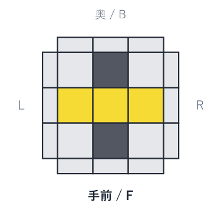<small>直線型</small></a><a href="#oll-front-l">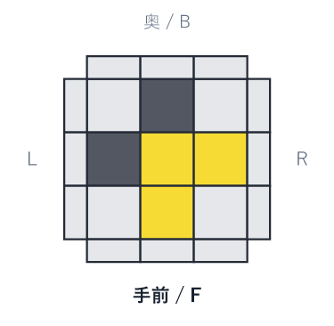<small>L字型</small></a><a href="#oll-front-dot">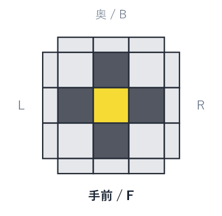<small>ドット型</small></a>

<h3>後半：黄色一面をそろえる</h3>
<a href="#oll-back-sune">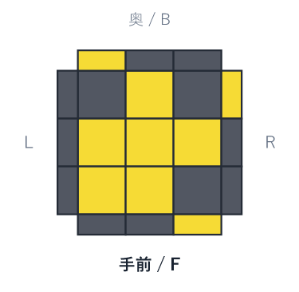<small>スーン</small></a><a href="#oll-back-antisune">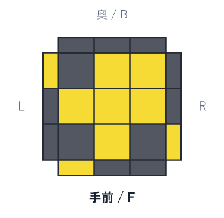<small>アンチスーン</small></a><a href="#oll-back-h">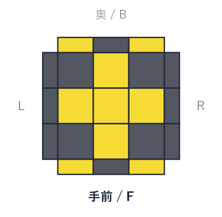<small>十字H</small></a><a href="#oll-back-l">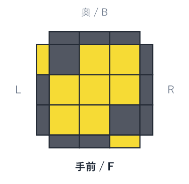<small>十字L</small></a><a href="#oll-back-t">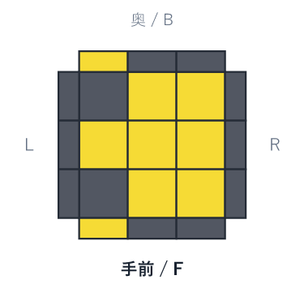<small>十字T</small></a><a href="#oll-back-pi">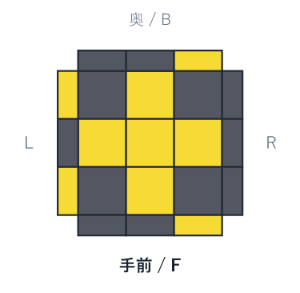<small>十字π</small></a><a href="#oll-back-u">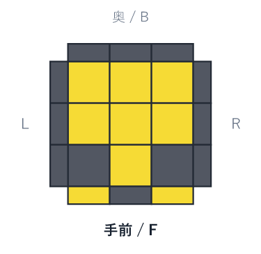<small>十字U</small></a>

<h3>前半：コーナーの位置をそろえる</h3>
<a href="#pll-front-t">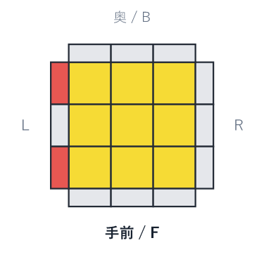<small>Tパーム</small></a><a href="#pll-front-y">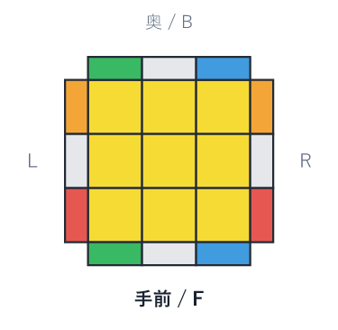<small>Yパーム</small></a>

<h3>後半：エッジの位置をそろえる</h3>
<a href="#pll-back-ua">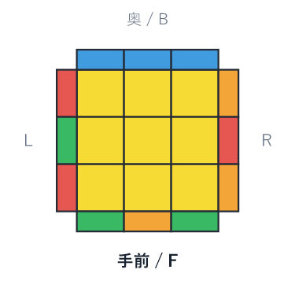<small>Uaパーム</small></a><a href="#pll-back-ub">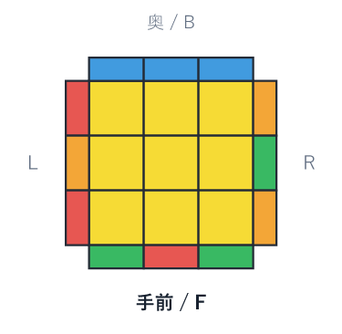<small>Ubパーム</small></a><a href="#pll-back-h">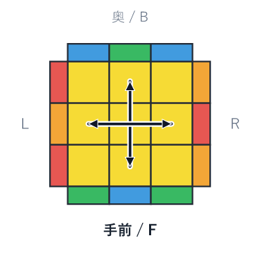<small>Hパーム</small></a><a href="#pll-back-z">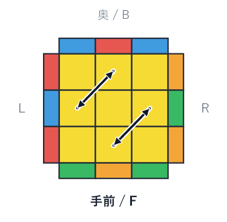<small>Zパーム</small></a>

## 2Look OLL 前半

### 直線型

[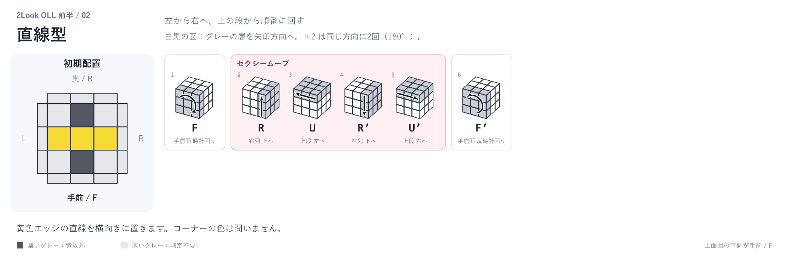](images/cube_02.svg)

黄色エッジの直線を横向きに置きます。コーナーの色は問いません。

`F` → セクシームーブ：`R U R' U'` → `F'`

### L字型

[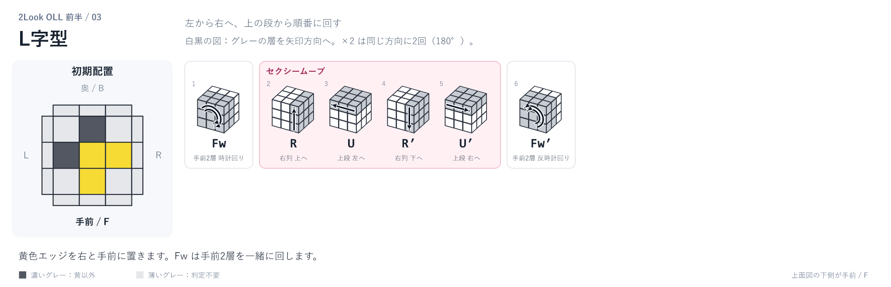](images/cube_03.svg)

黄色エッジを右と手前に置きます。Fw は手前2層を一緒に回します。

`Fw` → セクシームーブ：`R U R' U'` → `Fw'`

### ドット型

[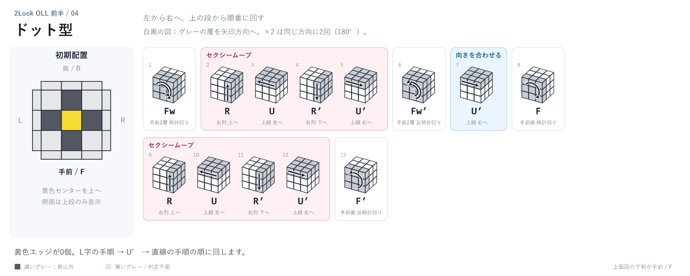](images/cube_04.svg)

黄色エッジが0個。L字の手順 → U′ → 直線の手順の順に回します。

`Fw` → セクシームーブ：`R U R' U'` → `Fw'` → 向きを合わせる：`U'` → `F` → セクシームーブ：`R U R' U'` → `F'`

## 2Look OLL 後半

### スーン

[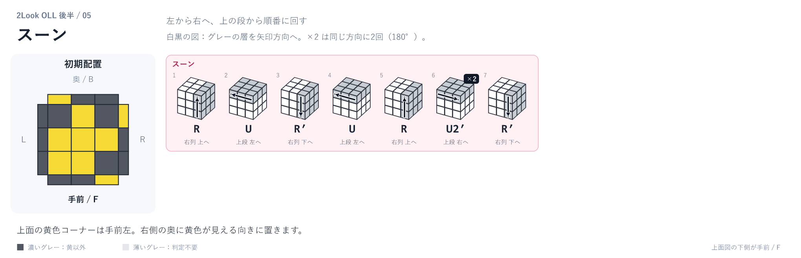](images/cube_05.svg)

上面の黄色コーナーは手前左。右側の奥に黄色が見える向きに置きます。

スーン：`R U R' U R U2' R'`

### アンチスーン

[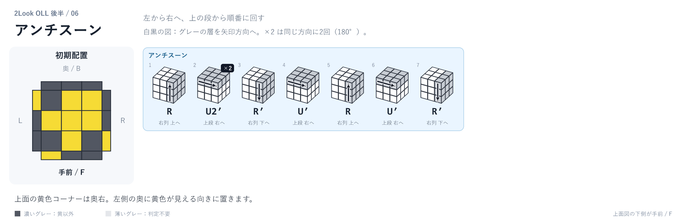](images/cube_06.svg)

上面の黄色コーナーは奥右。左側の奥に黄色が見える向きに置きます。

アンチスーン：`R U2' R' U' R U' R'`

### 十字H

[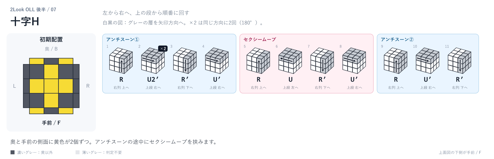](images/cube_07.svg)

奥と手前の側面に黄色が2個ずつ。アンチスーンの途中にセクシームーブを挟みます。

アンチスーン①：`R U2' R' U'` → セクシームーブ：`R U R' U'` → アンチスーン②：`R U' R'`

### 十字L

[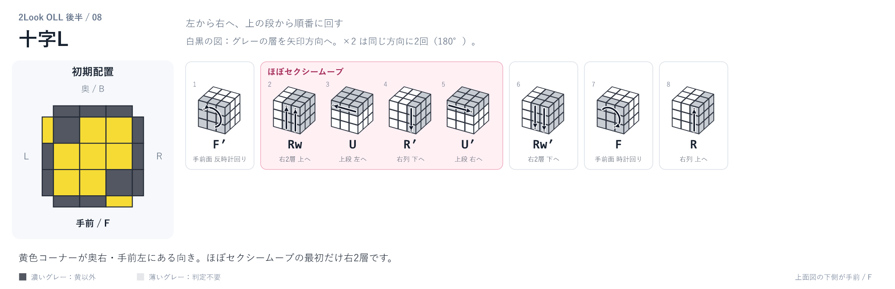](images/cube_08.svg)

黄色コーナーが奥右・手前左にある向き。ほぼセクシームーブの最初だけ右2層です。

`F'` → ほぼセクシームーブ：`Rw U R' U'` → `Rw' F R`

### 十字T

[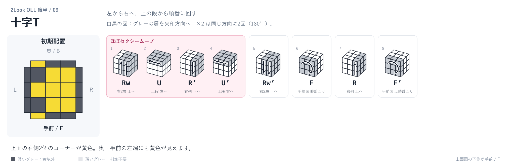](images/cube_09.svg)

上面の右側2個のコーナーが黄色。奥・手前の左端にも黄色が見えます。

ほぼセクシームーブ：`Rw U R' U'` → `Rw' F R F'`

### 十字π

[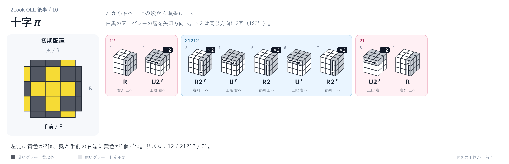](images/cube_10.svg)

左側に黄色が2個、奥と手前の右端に黄色が1個ずつ。リズム：12 / 21212 / 21。

12：`R U2'` → 21212：`R2' U' R2 U' R2'` → 21：`U2' R`

### 十字U

[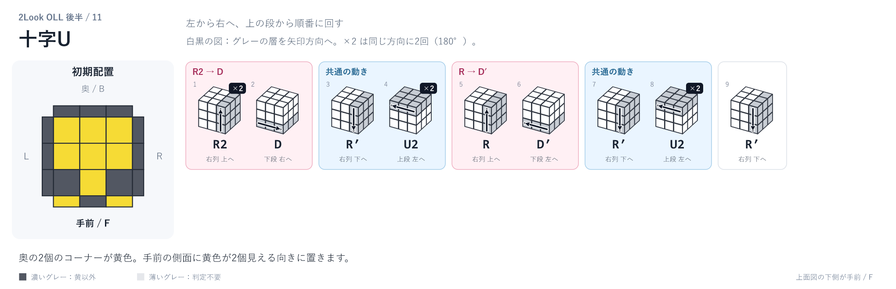](images/cube_11.svg)

奥の2個のコーナーが黄色。手前の側面に黄色が2個見える向きに置きます。

R2 → D：`R2 D` → 共通の動き：`R' U2` → R → D′：`R D'` → 共通の動き：`R' U2` → `R'`

## 2Look PLL 前半

### Tパーム

[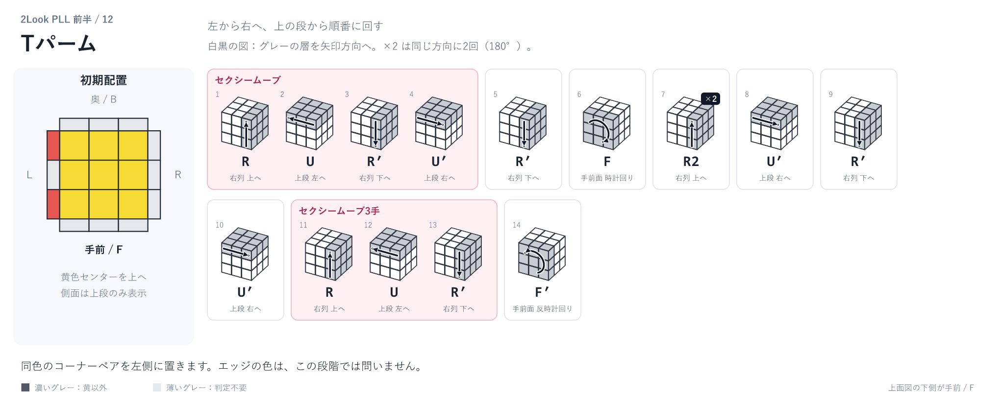](images/cube_12.svg)

同色のコーナーペアを左側に置きます。エッジの色は、この段階では問いません。

セクシームーブ：`R U R' U'` → `R' F R2 U' R' U'` → セクシームーブ3手：`R U R'` → `F'`

### Yパーム

[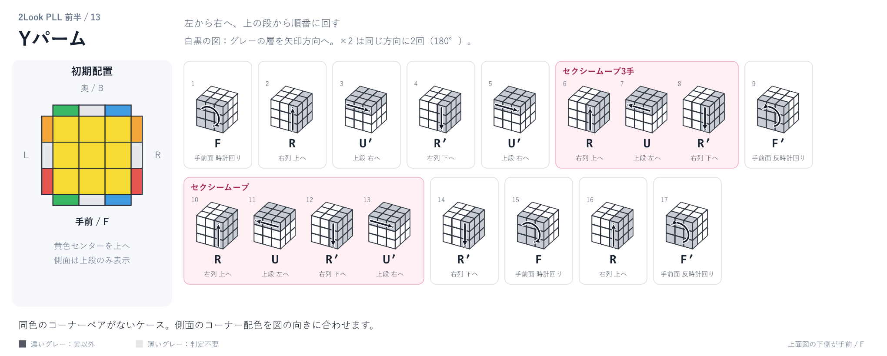](images/cube_13.svg)

同色のコーナーペアがないケース。側面のコーナー配色を図の向きに合わせます。

`F R U' R' U'` → セクシームーブ3手：`R U R'` → `F'` → セクシームーブ：`R U R' U'` → `R' F R F'`

## 2Look PLL 後半

### Uaパーム

[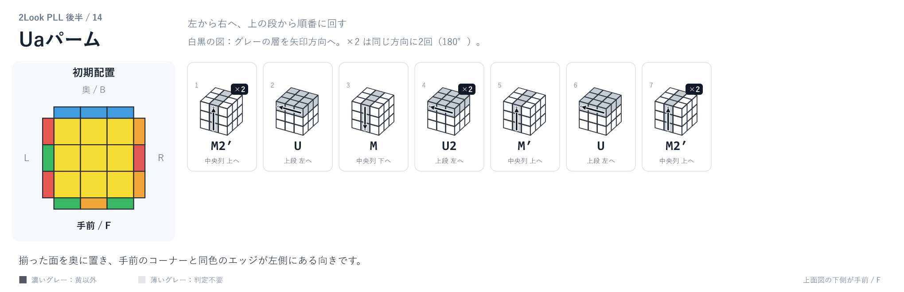](images/cube_14.svg)

揃った面を奥に置き、手前のコーナーと同色のエッジが左側にある向きです。

`M2' U M U2 M' U M2'`

### Ubパーム

[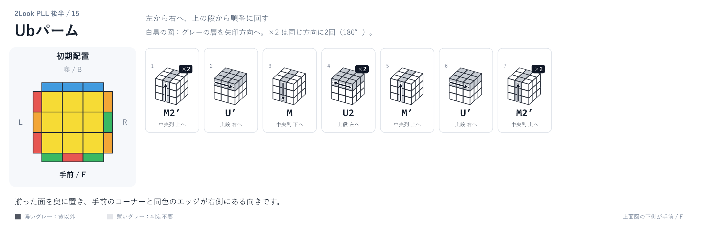](images/cube_15.svg)

揃った面を奥に置き、手前のコーナーと同色のエッジが右側にある向きです。

`M2' U' M U2 M' U' M2'`

### Hパーム

[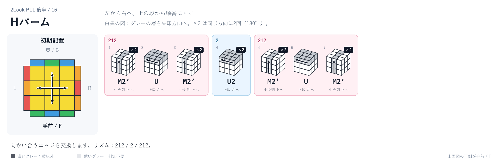](images/cube_16.svg)

向かい合うエッジを交換します。リズム：212 / 2 / 212。

212：`M2' U M2'` → 2：`U2` → 212：`M2' U M2'`

### Zパーム

[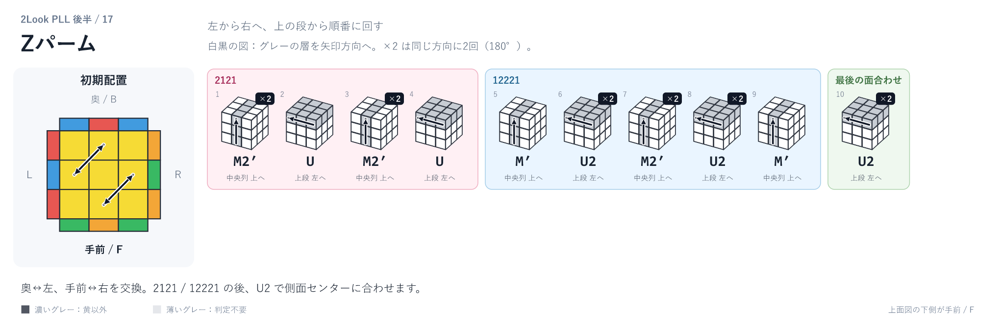](images/cube_17.svg)

奥↔左、手前↔右を交換。2121 / 12221 の後、U2 で側面センターに合わせます。

2121：`M2' U M2' U` → 12221：`M' U2 M2' U2 M'` → 最後の面合わせ：`U2`

手順の参考：[元の解説動画](https://www.youtube.com/watch?v=cEtg0IMPVQs)。図は独自に描画しています。
